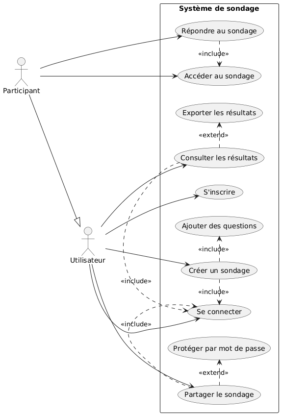
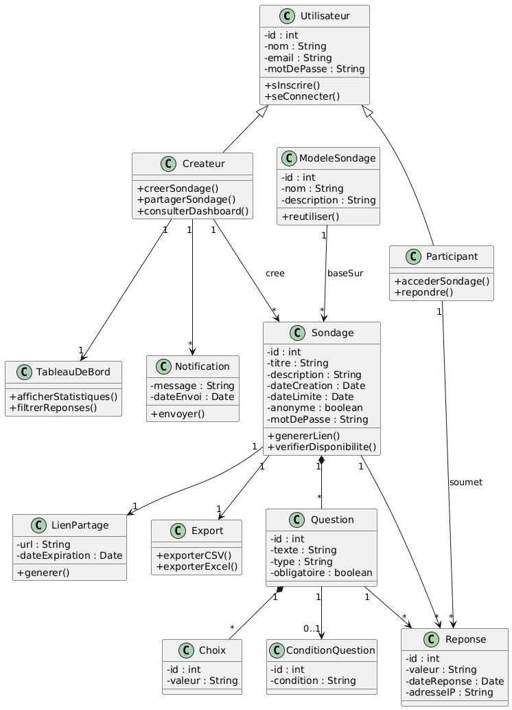
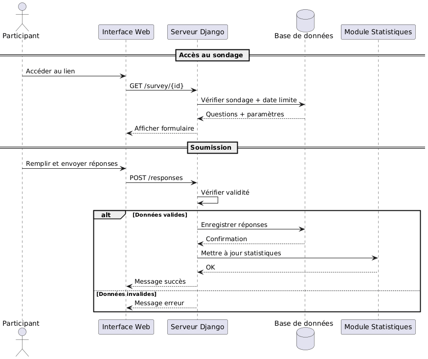
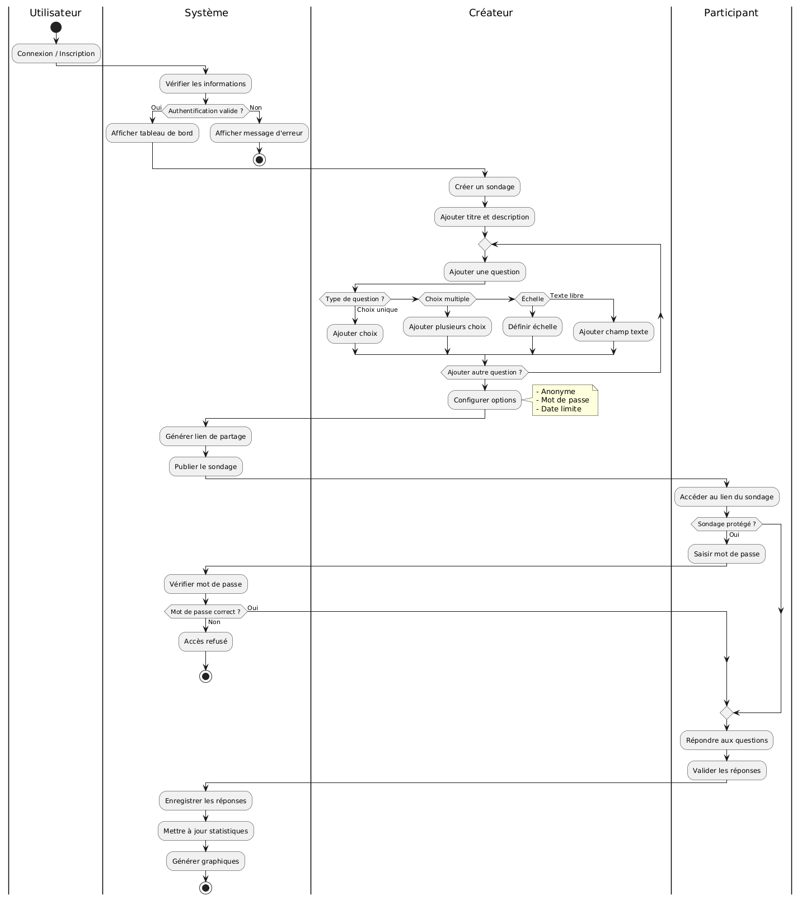
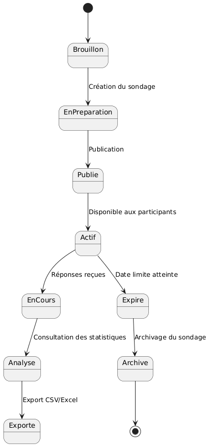

# project-python-sondage-app

Application web de sondages dynamiques developpee avec Django. Le projet permet de creer, diffuser, proteger et analyser des sondages en ligne avec authentification, questions dynamiques, partage par lien, statistiques et visualisation graphique des resultats.

## Realise par

- Mouad Mezyan
- Marouane Younsi
- Marwane Hatimi

## Fonctionnalites principales

- Authentification des utilisateurs
- Creation et gestion de sondages
- Questions a choix unique, choix multiple, texte libre et echelle
- Questions conditionnelles
- Protection des sondages par mot de passe
- Limitation des reponses par utilisateur ou adresse IP
- Tableau de bord et suivi des resultats
- Notifications utilisateur
- Visualisation des statistiques avec graphiques

## Technologies utilisees

- Python
- Django
- Django REST Framework
- MySQL / MariaDB
- HTML5
- CSS3
- JavaScript
- Bootstrap
- Chart.js

## Structure du projet

```text
project-python-sondage-app/
|-- docs/
|   |-- diagrams/
|   |-- rapport_sondagepro_django.pdf
|   `-- rapport_sondagepro_django.docx
|-- python Me/
|   |-- manage.py
|   |-- poll_app/
|   |-- polls/
|   |-- static/
|   `-- templates/
`-- README.md
```

## Documentation

| Document | Lien |
| --- | --- |
| Rapport du projet | [docs/rapport_sondagepro_django.pdf](docs/rapport_sondagepro_django.pdf) |
| Version Word du rapport | [docs/rapport_sondagepro_django.docx](docs/rapport_sondagepro_django.docx) |
| Presentation | Fichier `presentation.pdf` non present dans le depot |
| Cahier des charges | Fichier `cdc.pdf` non present dans le depot |

## Diagrammes

### Diagramme de cas d'utilisation



### Diagramme de classes



### Diagramme de sequence



### Diagramme d'activite



### Diagramme de transition d'etat



## Installation et demarrage

1. Cloner le depot :

```bash
git clone https://github.com/Mouad05-mz/project-python-sondage-app.git
cd project-python-sondage-app
```

2. Creer et activer un environnement virtuel :

```bash
python -m venv venv
venv\Scripts\activate
```

3. Installer les dependances :

```bash
pip install django djangorestframework mysqlclient openpyxl
```

4. Se placer dans le projet Django :

```bash
cd "python Me"
```

5. Appliquer les migrations :

```bash
python manage.py migrate
```

6. Lancer le serveur :

```bash
python manage.py runserver
```

L'application sera accessible sur `http://127.0.0.1:8000/`.
